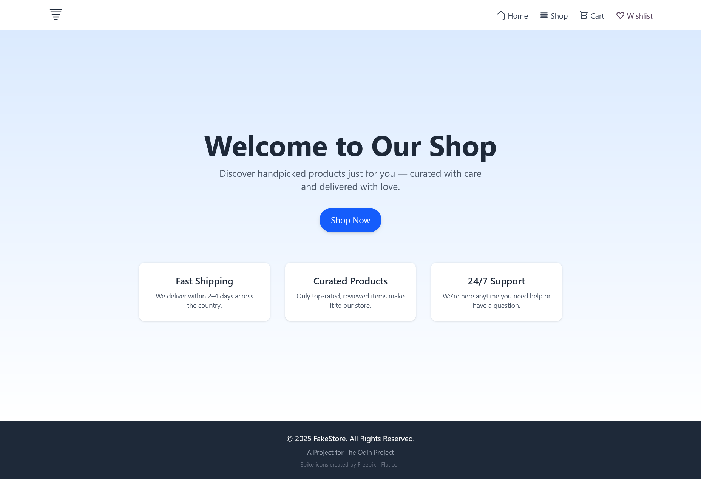

# Fake Store Mate

[](https://app.netlify.com/projects/fakeshoppingcartapp/deploys)

A responsive e-commerce storefront built with React, featuring a dynamic shopping cart, wishlist, and product catalog fetched from a live API. This project was developed as part of The Odin Project curriculum.

**[Live Demo](https://fakeshoppingcartapp.netlify.app/)** | **[Project Assignment](https://www.theodinproject.com/lessons/node-path-react-new-shopping-cart)**



## About This Project

Fake Store Mate is a front-end application that simulates a real-world online shopping experience. It's designed to showcase modern React development practices, including component-based architecture, state management with hooks, and asynchronous data handling. The project emphasizes a clean, intuitive user interface and a robust, test-driven development process.

## Features

- **Dynamic Product Catalog:** Products are fetched asynchronously from the [FakeStoreAPI](https://fakestoreapi.com/).
- **Shopping Cart:** Users can add, remove, and view items in their cart.
- **Wishlist:** A separate list for users to save items they're interested in.
- **Responsive Design:** A mobile-first layout that adapts to all screen sizes, built with Tailwind CSS.
- **Robust Testing:** A comprehensive test suite using Vitest and React Testing Library ensures application stability.

## Built With


## How to Run Locally

To get a local copy up and running, follow these simple steps.

### Prerequisites

- Node.js (v18 or later)
- npm

### Installation

1.  **Clone the repo**
    ```sh
    git clone https://github.com/Ayush-Tak/shopping-cart.git
    ```
2.  **Navigate to the project directory**
    ```sh
    cd shopping-cart
    ```
3.  **Install NPM packages**
    ```sh
    npm install
    ```
4.  **Start the development server**
    ```sh
    npm run dev
    ```
    Your application will be running at `http://localhost:5173`.

### Running Tests

To run the test suite:

```sh
npm test
```

## Acknowledgements

- **Project:** [The Odin Project](https://www.theodinproject.com)
- **API:** [FakeStoreAPI](https://fakestoreapi.com/)
- **Icon:** [Spike icons created by Freepik - Flaticon](https://www.flaticon.com/free-icons/spike)
